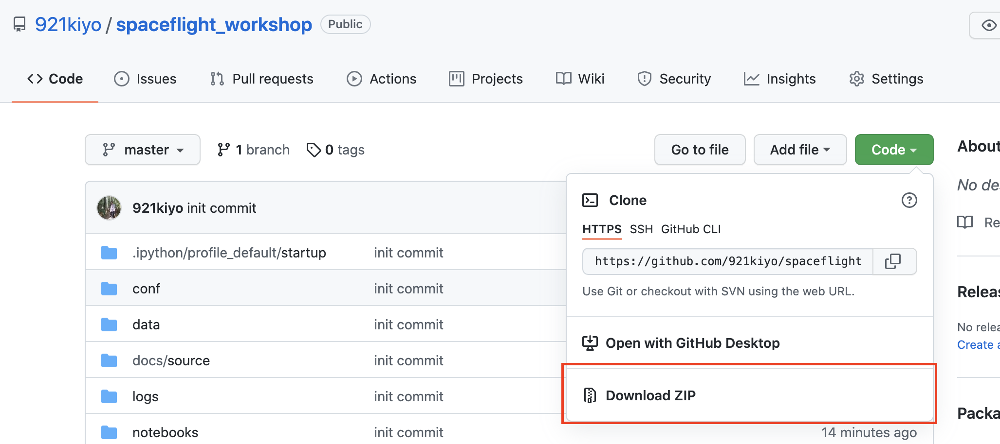

# Training prerequisites
## Operating system
Kedro supports macOS, Linux and Windows (7 / 8 / 10 and Windows Server 2016+).

## Command line
You will need to use the command line interface, or CLI, which is a text-based application to view, navigate and manipulate files on your computer.

[Find out more about working with the command line](https://tutorial.djangogirls.org/en/intro_to_command_line/) (also known as cmd, CLI, prompt, console or terminal).

- [Terminal on macOS](https://support.apple.com/en-gb/guide/terminal/welcome/mac)
- [Windows command line](https://www.computerhope.com/issues/chusedos.htm)

## Python
Kedro supports [Python 3.6, 3.7 or 3.8](https://www.python.org/downloads/) so you should make sure that it is installed on your laptop.

We recommend using [Anaconda](https://www.anaconda.com/download) (Python 3.7 version) to install Python packages. You can also use `conda`, which comes with Anaconda, as a virtual environment manager when you install Kedro.

## Kedro
Follow the official [Kedro prerequisites documentation](https://kedro.readthedocs.io/en/latest/02_get_started/01_prerequisites.html) and the page that follows it to [install Kedro](https://kedro.readthedocs.io/en/latest/02_get_started/02_install.html).

A clean install of Kedro is designed to be lightweight. If you later need additional tools, it is possible to install them later.

>**Note**: If you encounter any problems, please engage Kedro community support on [Stack Overflow](https://stackoverflow.com/questions/tagged/kedro), or refer to the [Kedro.Community Discourse channel](https://discourse.kedro.community/) that is managed by Kedroids all over the world.

## Code editor
There are many code editors to choose from. Here are some we recommend:

- [PyCharm](https://www.jetbrains.com/pycharm/download/)
- [VS Code IDE](https://code.visualstudio.com/)
- [Atom](https://atom.io/)

## Download Kedro workshop code
Download [the workshop code](https://github.com/quantumblacklabs/kedro-training) by either running the following command in your Terminal, or manually download the zip file.
- [Git clone](https://docs.github.com/en/repositories/creating-and-managing-repositories/cloning-a-repository) (SSH)
```bash
git clone git@github.com:921kiyo/spaceflight_workshop.git
```
- Git clone (HTTPS)
```bash
git clone https://github.com/921kiyo/spaceflight_workshop.git
```
- Manual Zip download



## Git (optional)

Git is a version control system that records changes to files as you work on them. Git is especially helpful for software developers as it allows changes to be tracked (including who and when) across a project.

When you [download `git`](https://git-scm.com/downloads), be sure to choose the correct version for your operating system:

### Installing Git on Windows
Download the [`git` for Windows installer](https://gitforwindows.org/). Make sure to select **Use `git` from the Windows command prompt** this will ensure that `git` is permanently added to your PATH.

Also select **Checkout Windows-style, commit Unix-style line endings** selected and click on **Next**.

This will provide you both `git` and `git bash`, which you will find useful during the training.

### GitHub
GitHub is a web-based service for version control using Git. To use it, you will need to [set up an account](https://github.com).


## Checklist
Please use this checklist to make sure you have everything necessary to participate in the Kedro training.

- [ ] You have [Python 3 (either 3.6, 3.7 or 3.8)](https://www.python.org/downloads/) installed on your laptop

- [ ] You have Anaconda or an alternative [virtual environment manager](https://kedro.readthedocs.io/en/stable/02_get_started/01_prerequisites.html#virtual-environments) virtual environment manager

- [ ] You have installed [Kedro](#kedro)

- [ ] You have [downloaded the `kedro-training` repository](#kedro-training-code)

- [ ] You have [a code editor](#code-editor) installed for writing Python code

- [ ] You have a [command line](#command-line) installed

Having completed the above checklist, make sure that you are able to execute the following commands from your command line interface:

- [ ]  `python --version` or `python3 --version` returns a correct Python version (either 3.6, 3.7 or 3.8).

- [ ]  `kedro --version` shows `0.17.5`.


If you are able to complete all of the above, you are ready for the training!

>**Note**: If you have any problems or questions in any of the above checklist, please contact an instructor and resolve the issues before the training.
